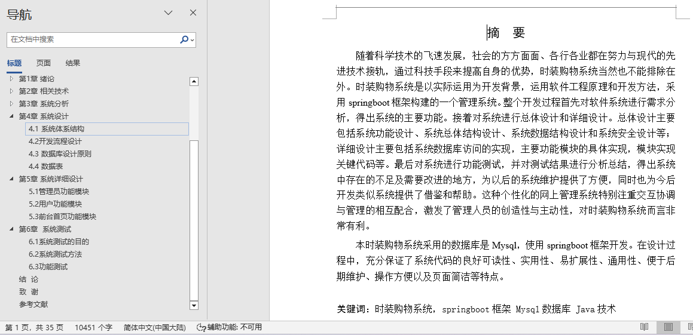

## 网页时装购物系统(程序+报告)

###  获取sql数据库文件: 从戎源码网 (https://armycodes.com/) QQ: 386869957 QQ群: 377586148
###  所有系统地址: (https://github.com/YuLin-Coder/AllProjectCatalog) 
###  所有项目以及源代码本人均调试运行无问题 可支持远程安装部署调试、定制修改、代码讲解

## 项目介绍
网页时装购物系统，系统包含两种角色：用户、管理员，系统分为前台和后台两大模块，主要功能如下：

1 管理员功能模块
管理员登录: 管理员通过用户名、密码、角色进行登录。
首页和个人中心: 查看系统的总体信息和个人信息。
用户管理: 管理用户的详细信息，进行详情查看、修改。
商品分类管理: 管理商品分类，进行详情查看、修改或删除。
颜色管理: 查看和管理颜色信息，进行详情查看、修改或删除。
商品信息管理: 管理商品的详细信息，包括名称、分类、图片等，进行详情查看、修改或删除。
商品资讯管理: 管理商品的资讯信息，进行详情查看、修改或删除。
轮播图管理: 管理首页轮播图，添加、修改或删除图片。
客服管理: 查看和管理客服消息和状态，进行详情查看、修改或删除。
订单管理: 查看和管理订单信息，进行详情查看、修改或删除。

2 用户功能模块
用户登录: 用户通过用户名和密码登录系统。
首页和个人中心: 查看个人信息和系统的总体信息。
商品评价管理: 管理商品评价信息，进行详情查看和修改。
我的收藏管理: 查看和管理收藏的商品，进行修改或删除。
订单管理: 查看和管理订单信息，进行详情查看和删除。

3 前台首页功能模块
首页: 查看系统的总体信息。
商品信息: 查看商品的详细信息，进行添加到购物车或立即购买。
商品资讯: 查看商品的资讯信息。
个人中心: 查看个人信息。
后台管理: 进入后台管理系统。
购物车: 查看和管理购物车中的商品。
客服: 查看和管理客服信息。
用户注册: 用户通过注册获取用户名、密码等信息进行注册、登录。
我的订单: 查看和管理订单信息，进行提交。

## 项目技术
- 编程语言：Java
- 数据库：MySQL
- 项目管理工具：Maven
- 前端技术：HTML、CSS、JavaScript、Vue
- 后端技术：Spring、SpringMVC、MyBatis

## 运行环境
- JDK版本：JDK1.8及以上
- 开发工具：IDEA、Ecplise、Myecplise都可以
- 数据库: MySQL5.7及以上
- Maven：maven3.0及以上
- Node：14.14.0及以上

## 运行截图

